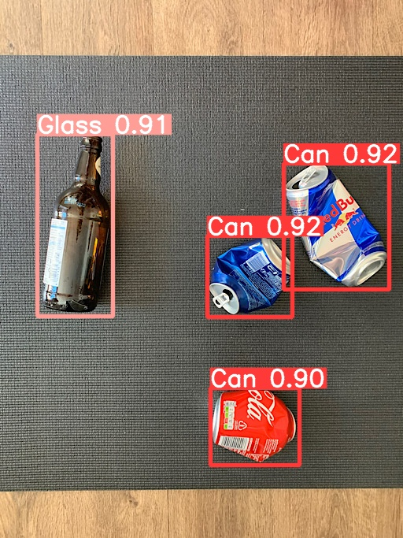

# 回收分類

## 分類順序

| Label     |  物品   | 
| --------  |:------  | 
|  0        | Can     | 
|  1        | Glass   | 
|  2        | China   |
|  3        | Plastic | 

## 訓練結果 

## 自動標註並生成txt檔
> 需有yolov5
1. 下載exp16\weights
2. 在yolov5資料夾開啟cmd(命令提示字元)
3. 在cmd輸入
`python detect.py --weight [下載的weight檔的絕對位置] --source [要判斷的圖片或多張照片的資料夾絕對位置] --save-txt`
>有中文路徑可能不行
4. 標註好的照片在 cmd上他會寫放在 `run\detect\...`就去yolov5的資料夾裡找

## 檢測結果 

